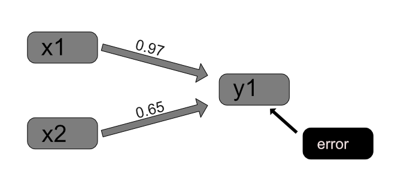
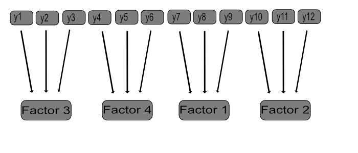

## Week 1


#### Exercise 1.2


#### a) LINEAR REGRESSION


In this exercise a linear regression model was built for one continuous observed dependent variable (y1) with two covariates (x1 and x3). The data "ex3.1" was first manually imported into R and saved as .Rdata -file with R code lines:


df <- ex3.1


save(df, file="df.Rdata")


Here is a summary of the variables:

```{r df}
load("df.Rdata")
summary(df)
```

Then a model was built according to instructions (y1 is the dependent variable, x1 and x3 are independent explanatory variables):

```{r}
y1 <- df$V1
x1 <- df$V2
x3 <- df$V3

model <- lm(y1 ~ x1 + x3)
summary(model)
```

According to the results both covariates x1 and x3 are statistically significant (p < 0.001). They both have a positive effect on the variable y1: when x1 increases one unit, the variable y1 increases 0.97 units (when x3 is considered a constant) and when x3 increases one unit, the variable y1 increases 0.65 units (when x1 is considered a constant). The model explains around 60% of the variance in the variable y1 (Adjusted R-squared = 0.6075).

\smallbreak

##### The graph of the model is on top of this page (drawn with Affinity Designer):


```{r pressure, echo=FALSE, fig.cap="", out.width = '70%'}

```


#### b) EXPLORATORY FACTOR ANALYSIS

In this part an exploratory factor analysis is conducted according to instructions. The data file "ex4.1a" was imported manually into R and then wrangled so that the analysis could be run. The wrangling code is here:

df2 <- ex4.1a

colnames(df2) <- c("y1", "y2", "y3", "y4", "y5", "y6", "y7", "y8", "y9", "y10", "y11", "y12")

save(df2, file="df2.Rdata")

Let us view a summary of the data:

```{r df2}
load("df2.Rdata")
summary(df2)
```

The data consists of 500 rows and 12 columns. Let us conduct the exploratory factor analysis to learn about the factor structure of the data:

```{r}
analysis <- factanal(df2, factors = 4)
print(analysis)
```

Based on these results the data contains four factors. A graph of the model is presented here:

```{r echo=FALSE, fig.cap="", out.width = '70%'}

```
