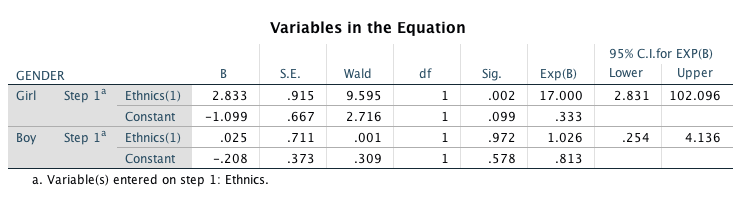

## Week 1

#### Exercise 1.2
#### a)

In this exercise a linear regression model was built for one continuous observed dependent variable (y1) with two covariates (x1 and x3). The data "ex3.1" was first manually imported into R and saved as .Rdata -file with R code lines:


df <- ex3.1


save(df, file="df.Rdata")


Let us view a summary of the variables:

```{r df}
load("df.Rdata")
summary(df)
```

Then let us build the model according to instructions:

```{r}
y1 <- df$V1
x1 <- df$V2
x3 <- df$V3

model <- lm(y1 ~ x1 + x3)
summary(model)
```

```{r pressure, echo=FALSE, fig.cap="Kuvateksti", out.width = '100%'}

```
